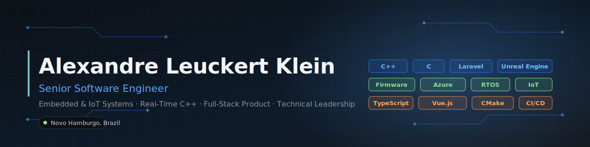
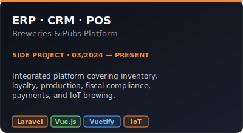
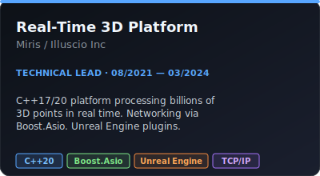
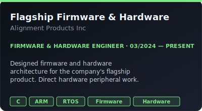
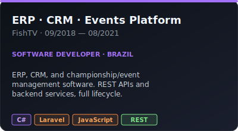
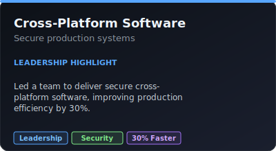
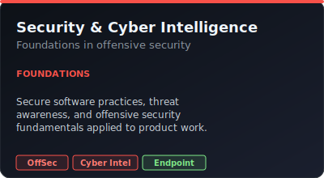

<!--
  Alexandre Leuckert Klein — GitHub profile README
  This file is rendered at https://github.com/AlexandreLKlein
-->

 

  

&nbsp;

&nbsp;

&nbsp;

---

## 👋 About me

I'm **Alexandre Klein**, a **Senior Software Engineer** based in **Novo Hamburgo, Brazil**, with experience building end-to-end products across embedded systems, backend platforms, and customer-facing applications.

I help startups turn ideas into production-ready systems by working across the **entire technology stack** — from **electronics and firmware** to **cloud services** and **modern web applications**. My work has directly contributed to the development of core products and supported the successful raise of **multiple millions of dollars in investment**.

I enjoy solving complex problems, taking ownership of critical systems end-to-end, and building products that bridge hardware, software, and real-world business needs.

---

## 🎯 Current focus

<table>
  <tr>
    <td width="33%" align="center" valign="top">
      <h3>🛠️ Embedded &amp; IoT</h3>
      
Firmware for ARM microcontrollers, RTOS design, hardware integration, and electronic architecture for commercial products.

      
<code>C</code> · <code>ARM</code> · <code>RTOS</code> · <code>Hardware</code>

    </td>
    <td width="33%" align="center" valign="top">
      <h3>⚡ Real-Time C++</h3>
      
High-performance C++17/20 platforms, networking &amp; streaming, multithreaded systems, and Unreal Engine integrations for VR.

      
<code>C++20</code> · <code>Boost.Asio</code> · <code>UE5</code> · <code>VR</code>

    </td>
    <td width="33%" align="center" valign="top">
      <h3>🌐 Full-Stack Product</h3>
      
ERP, CRM, and POS platforms integrating payments, fiscal compliance, IoT, and business operations end-to-end.

      
<code>Laravel</code> · <code>Vue.js</code> · <code>PHP</code> · <code>Azure</code>

    </td>
  </tr>
</table>

---

## 🧰 Tech stack

<b>Languages</b>

 

  
  
  
  
  
  

<b>Embedded &amp; IoT</b>

 

  
  
  
  

<b>Cloud &amp; DevOps</b>

 

  
  
  
  
  
  
  
  

<b>Web &amp; Frameworks</b>

 

  
  
  
  
  

<b>Networking &amp; Security</b>

 

  
  
  
  
  

---

## 📊 GitHub stats

> Self-hosted stats — auto-generated weekly by a GitHub Action and committed to [`assets/stats/`](assets/stats/). No live third-party calls.

  

📌 Stats appear after the first successful run of the <a href="actions/workflows/stats.yml">stats workflow</a>. Trigger it manually from the Actions tab to populate them immediately.

---

## 🚀 Featured work

<table>
  <tr>
    <td width="50%"></td>
    <td width="50%"></td>
  </tr>
  <tr>
    <td width="50%"></td>
    <td width="50%"></td>
  </tr>
  <tr>
    <td width="50%"></td>
    <td width="50%"></td>
  </tr>
</table>

---

## 🏆 Key achievements

<table>
  <tr>
    <td align="center" width="25%">
      <h2>12.5×</h2>
      revenue growth via an integrated ERP · CRM · POS platform for breweries
    </td>
    <td align="center" width="25%">
      <h2>Billions</h2>
      of 3D points processed per second in real-time applications
    </td>
    <td align="center" width="25%">
      <h2>$5M+</h2>
      raised across products I helped build and lead
    </td>
    <td align="center" width="25%">
      <h2>30%</h2>
      efficiency gain leading secure cross-platform software
    </td>
  </tr>
</table>

---

## 💼 Experience

**Firmware & Hardware Engineer** · **Alignment Products Inc** · `03/2024 — Present` · USA
> Designed and implemented firmware for the company's flagship product using C, developed hardware architectures, integrated embedded systems components, and contributed to product validation in a fast-paced startup environment.

**Technical Lead / Senior C++ Software Engineer** · **Miris / Illuscio Inc** · `08/2021 — 03/2024` · USA
> Architected core components for a real-time 3D point cloud platform (C++17/20), led technical initiatives, built networking & streaming via Boost.Asio, and shipped Unreal Engine plugins for VR environments.

**Software Developer** · **FishTV** · `09/2018 — 08/2021` · Brazil
> Developed and maintained ERP and CRM systems, built software for championship and event management, designed REST APIs, and supported the full software lifecycle.

---

## 🤝 Get in touch

&nbsp;

&nbsp;

&nbsp;

&nbsp;

---

📂 This profile repo is a public résumé. See <a href="RESUME.md">RESUME.md</a> for the full text version, or grab the <a href="AlexandreLeuckertKleinResume.pdf">PDF</a>.
